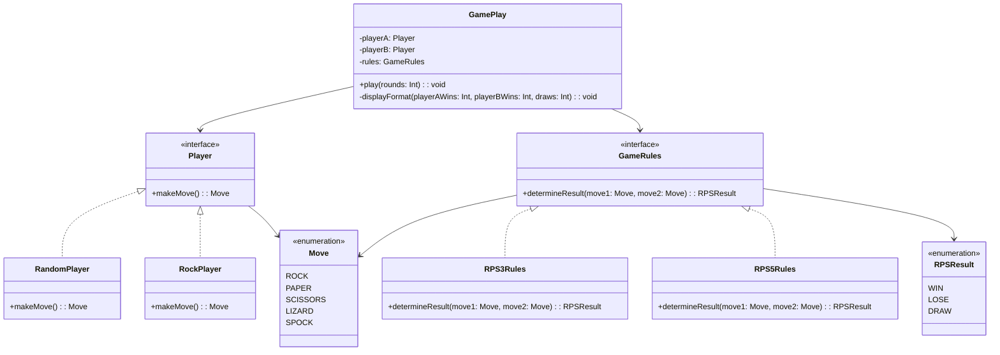

# Rock Paper Scissors Game - Kotlin Implementation

## Overview

This project is a Kotlin implementation of the classic **Rock, Paper, Scissors** game. The game simulates 100 rounds between two players with predefined behaviors:

- **Player A (RandomPlayer)**: Makes random choices between Rock, Paper, and Scissors.
- **Player B (RockPlayer)**: Always chooses Rock.

At the end of the simulation, the program displays the number of wins for each player and the number of draws.

## Project Requirements

The project fulfills the following requirements:

- **Players**:
    - One player plays randomly.
    - One player always chooses Rock.
- **Gameplay**:
    - The game plays 100 rounds automatically without user interaction.
    - Uses game logic to determine the result (WIN, LOSE, DRAW) for each round.
    - Calculates and displays the number of wins for each player and the number of draws.

## Getting Started

### Prerequisites

- **Kotlin**: Version 1.5 or higher.
- **Java Development Kit (JDK)**: Version 8 or higher.
- **Apache Maven**: Build automation tool (build files are included).

### Installation

1. **Clone the repository**:

    ```bash
    git clone https://github.com/khaled-qassim/java-kotlin-coding-interview.git
    ```

2. **Navigate to the project directory**:

    ```bash
    cd rock-paper-scissors
    ```

3. **Build the project using Maven**:

    ```bash
    mvn clean install
    ```

## Project Structure

The project is organized into several packages and classes:

- **enums**:
    - `Move`: Enum representing possible moves (ROCK, PAPER, SCISSORS, LIZARD, SPOCK).
    - `RPSResult`: Enum representing the result of a round (WIN, LOSE, DRAW).
- **model**:
    - `Player` (Interface): Defines the `makeMove()` method.
    - `RandomPlayer` (Class): Implements `Player`, makes random moves.
    - `RockPlayer` (Class): Implements `Player`, always chooses ROCK.
- **logic**:
    - `GameRules` (Interface): Defines the `determineResult()` method.
    - `RPS3Rules` (Class): Implements `GameRules` for Rock, Paper, Scissors.
    - `RPS5Rules` (Class): Implements `GameRules` for Rock, Paper, Scissors, Lizard, Spock.
- **service**:
    - `GamePlay` (Class): Manages the game rounds and results.
- **Main Function**:
    - `main.kt`: Entry point of the application.

## Game Logic

### Move Enumeration

The `Move` enum defines the possible moves in the game:

```kotlin
package enums

enum class Move {
    ROCK, PAPER, SCISSORS, LIZARD, SPOCK
}
```

### RPSResult Enumeration

The `RPSResult` enum defines the possible outcomes of a round:

```kotlin
package com.hadsol.enums

enum class RPSResult {
    WIN, LOSE, DRAW
}
```

### GameRules Interface

The `GameRules` interface allows for different game rules to be implemented:

```kotlin
package com.hadsol.logic

import com.hadsol.enums.RPSResult
import enums.Move

interface GameRules {
    fun determineResult(move1: Move, move2: Move): RPSResult
}
```

### RPS3Rules Class

Implements standard Rock, Paper, Scissors rules:

```kotlin
package com.hadsol.logic

import com.hadsol.enums.RPSResult
import enums.Move

class RPS3Rules : GameRules {

    /** Normal Rock Paper Scissors rules, with Rock beating Scissors,
        Scissors beating Paper, and Paper beating Rock */
    override fun determineResult(move1: Move, move2: Move): RPSResult {
        return when {
            move1 == move2 -> RPSResult.DRAW
            (move1 == Move.ROCK && move2 == Move.SCISSORS) ||
            (move1 == Move.SCISSORS && move2 == Move.PAPER) ||
            (move1 == Move.PAPER && move2 == Move.ROCK) -> RPSResult.WIN
            else -> RPSResult.LOSE
        }
    }
}
```

### RPS5Rules Class

Implements Rock, Paper, Scissors, Lizard, Spock rules:

```kotlin
package logic

import com.hadsol.enums.RPSResult
import com.hadsol.logic.GameRules
import enums.Move

class RPS5Rules : GameRules {

    /** Rock Paper Scissors Lizard Spock rules */
    override fun determineResult(move1: Move, move2: Move): RPSResult {
        return when {
            move1 == move2 -> RPSResult.DRAW
            (move1 == Move.ROCK && (move2 == Move.SCISSORS || move2 == Move.LIZARD)) ||
            (move1 == Move.PAPER && (move2 == Move.ROCK || move2 == Move.SPOCK)) ||
            (move1 == Move.SCISSORS && (move2 == Move.PAPER || move2 == Move.LIZARD)) ||
            (move1 == Move.LIZARD && (move2 == Move.SPOCK || move2 == Move.PAPER)) ||
            (move1 == Move.SPOCK && (move2 == Move.SCISSORS || move2 == Move.ROCK)) -> RPSResult.WIN
            else -> RPSResult.LOSE
        }
    }
}
```

## Design Principles

### SOLID Principles

1. **Single Responsibility Principle (SRP)**: Each class has a single responsibility.
    - `RandomPlayer`: Generates random moves.
    - `RockPlayer`: Always chooses ROCK.
    - `GamePlay`: Manages the game flow and results.
    - `GameRules`: Defines the interface for game logic.

2. **Open/Closed Principle (OCP)**: The system is open for extension but closed for modification.
    - New game rules can be added by implementing the `GameRules` interface without altering existing code.

3. **Liskov Substitution Principle (LSP)**: Subtypes must be substitutable for their base types.
    - Both `RandomPlayer` and `RockPlayer` can be used wherever `Player` is expected.

4. **Interface Segregation Principle (ISP)**: Interfaces should be client-specific.
    - `Player` and `GameRules` interfaces are focused and do not force implementing classes to unused methods.

5. **Dependency Inversion Principle (DIP)**: Depend upon abstractions, not concretions.
    - `GamePlay` depends on `Player` and `GameRules` interfaces.

### Design Patterns

- **Strategy Pattern**: `GameRules` interface and its implementations (`RPS3Rules`, `RPS5Rules`) enable interchangeable algorithms.
- **Factory Pattern**: While not explicitly implemented, players can be created dynamically, allowing easy instantiation of different player types.

## Class Diagram



## Usage

### How to Run

1. **Run the application using Maven**:

    ```bash
    mvn exec:java -Dexec.mainClass="com.hadsol.MainKt"
    ```

2. **Execution**:

   The program will automatically play 100 rounds between `RandomPlayer` and `RockPlayer` using `RPS3Rules` and display the results.

### Main Function

```kotlin
package com.hadsol

import com.hadsol.logic.RPS3Rules
import com.hadsol.service.GamePlay
import model.RandomPlayer
import model.RockPlayer

fun main() {
    val game = GamePlay(RandomPlayer(), RockPlayer(), RPS3Rules())
    game.play(100)
}
```

### Sample Output

```
Player A wins 33 of 100 games
Player B wins 39 of 100 games
Draws: 28 of 100 games
```

## Testing

The project follows a test-driven development approach. Tests ensure high coverage and validate the correctness of the game logic.

### Running Tests

Run the tests using Maven:

```bash
mvn test
```

### Test Coverage

The tests cover:

- **Game Logic**: Ensuring that the `determineResult()` method returns correct results for all possible combinations.
- **Players**:
    - `RandomPlayer`: Generates moves randomly among available options.
    - `RockPlayer`: Always selects ROCK.
- **Gameplay**: Verifying that `GamePlay` correctly tracks wins, losses, and draws over multiple rounds.

### Sample Test Cases

- Testing `RPS3Rules` for all possible move combinations.
- Checking that `RandomPlayer` does not always produce the same move.
- Verifying the output format of the results.

## Future Enhancements

- **Extend Game Rules**: Introduce additional game variants by implementing more `GameRules` (e.g., `RPSLSRules` for Rock-Paper-Scissors-Lizard-Spock).
- **Human Player Interaction**: Allow user input to play against the computer.
- **Improved Randomness**: Enhance the randomness of `RandomPlayer` using secure random generators.
- **Graphical Interface**: Develop a GUI for better user experience.
- **Detailed Statistics**: Provide more in-depth statistics, such as winning streaks or percentage of wins.

## Conclusion

This project demonstrates a clean and extendable implementation of the Rock, Paper, Scissors game in Kotlin. By adhering to SOLID principles and utilizing design patterns, the application is well-structured and prepared for future enhancements.

---

## Maven Configuration

The project uses Maven as the build automation tool. The `pom.xml` file includes all necessary dependencies and plugins to compile, test, and run the application.

### pom.xml

```xml
<?xml version="1.0" encoding="UTF-8"?>
<project xmlns="http://maven.apache.org/POM/4.0.0"
         xmlns:xsi="http://www.w3.org/2001/XMLSchema-instance"
         xsi:schemaLocation="http://maven.apache.org/POM/4.0.0 http://maven.apache.org/xsd/maven-4.0.0.xsd">
    <modelVersion>4.0.0</modelVersion>

    <groupId>com.hadsol</groupId>
    <artifactId>rockpaperscissor</artifactId>
    <version>1.0-SNAPSHOT</version>

    <properties>
        <project.build.sourceEncoding>UTF-8</project.build.sourceEncoding>
        <kotlin.code.style>official</kotlin.code.style>
        <kotlin.compiler.jvmTarget>1.8</kotlin.compiler.jvmTarget>
        <junit.version>5.8.2</junit.version>
        <mockito.version>5.3.1</mockito.version>
        <mockito.kotlin.version>4.1.0</mockito.kotlin.version>

    </properties>

    <repositories>
        <repository>
            <id>mavenCentral</id>
            <url>https://repo1.maven.org/maven2/</url>
        </repository>
    </repositories>

    <build>
        <sourceDirectory>src/main/kotlin</sourceDirectory>
        <testSourceDirectory>src/test/kotlin</testSourceDirectory>
        <plugins>
            <plugin>
                <groupId>org.apache.maven.plugins</groupId>
                <artifactId>maven-jar-plugin</artifactId>
                <version>3.2.0</version>
                <configuration>
                    <archive>
                        <manifest>
                            <addDefaultImplementationEntries>true</addDefaultImplementationEntries>
                            <mainClass>com.hadsol.MainKt</mainClass> <!-- Replace with your main class -->
                        </manifest>
                    </archive>
                </configuration>
            </plugin>

            <plugin>
                <groupId>org.jetbrains.kotlin</groupId>
                <artifactId>kotlin-maven-plugin</artifactId>
                <version>2.1.0</version>
                <executions>
                    <execution>
                        <id>compile</id>
                        <phase>compile</phase>
                        <goals>
                            <goal>compile</goal>
                        </goals>
                    </execution>
                    <execution>
                        <id>test-compile</id>
                        <phase>test-compile</phase>
                        <goals>
                            <goal>test-compile</goal>
                        </goals>
                    </execution>
                </executions>
            </plugin>
            <plugin>
                <artifactId>maven-surefire-plugin</artifactId>
                <version>2.22.2</version>
            </plugin>
            <plugin>
                <artifactId>maven-failsafe-plugin</artifactId>
                <version>2.22.2</version>
            </plugin>
            <plugin>
                <groupId>org.codehaus.mojo</groupId>
                <artifactId>exec-maven-plugin</artifactId>
                <version>1.6.0</version>
                <configuration>
                    <mainClass>MainKt</mainClass>
                </configuration>
            </plugin>
        </plugins>
    </build>

    <dependencies>
        <!-- Mockito Core -->
        <dependency>
            <groupId>org.mockito</groupId>
            <artifactId>mockito-core</artifactId>
            <version>${mockito.version}</version>
            <scope>test</scope>
        </dependency>

        <!-- Mockito JUnit Jupiter -->
        <dependency>
            <groupId>org.mockito</groupId>
            <artifactId>mockito-junit-jupiter</artifactId>
            <version>${mockito.version}</version>
            <scope>test</scope>
        </dependency>

        <dependency>
            <groupId>org.junit.jupiter</groupId>
            <artifactId>junit-jupiter-api</artifactId>
            <version>${junit.version}</version>
            <scope>test</scope>
        </dependency>
        <dependency>
            <groupId>org.junit.jupiter</groupId>
            <artifactId>junit-jupiter-engine</artifactId>
            <version>${junit.version}</version>
            <scope>test</scope>
        </dependency>
        <dependency>
            <groupId>org.junit.jupiter</groupId>
            <artifactId>junit-jupiter</artifactId>
            <version>5.10.0</version>
            <scope>test</scope>
        </dependency>
        <dependency>
            <groupId>org.jetbrains.kotlin</groupId>
            <artifactId>kotlin-stdlib</artifactId>
            <version>2.1.0</version>
        </dependency>
    </dependencies>

</project>
```

### Notes on Maven Configuration

- **Kotlin Maven Plugin**: Configured to compile Kotlin code.
- **Maven Compiler Plugin**: Ensures Java version compatibility.
- **Maven Exec Plugin**: Allows running the application using `mvn exec:java`.
- **Dependencies**: Only essential dependencies are included (Kotlin standard library and JUnit for testing).

## Additional Information

### Package Structure

The package structure follows standard conventions:

- **src/main/kotlin**: Contains application source code.
- **src/test/kotlin**: Contains test source code.

### Running the Application

After building the project, the application can be executed using the Maven Exec Plugin:

```bash
mvn exec:java -Dexec.mainClass="com.hadsol.MainKt"
```

### Building the Project

To clean and build the project:

```bash
mvn clean install
```

This command will:

- Clean the `target` directory.
- Compile the source code.
- Run the tests.
- Package the application.

### Maven Goals and Phases

- **compile**: Compiles the source code.
- **test**: Runs the tests.
- **package**: Packages the compiled code into a JAR file.
- **install**: Installs the package into the local repository.

### Integrating with IDEs

Most modern IDEs like IntelliJ IDEA and Eclipse support Maven projects natively. You can import the project as a Maven project to facilitate development.

## Troubleshooting

### Common Issues

- **Kotlin Version Compatibility**: Ensure the Kotlin version specified in `pom.xml` matches the Kotlin plugin version in your IDE.
- **Main Class Not Found**: Verify that the `mainClass` property in `pom.xml` correctly points to your application's entry point (`com.hadsol.MainKt`).

### Resolving Dependencies

If you encounter dependency resolution errors:

- Run `mvn clean install` to force Maven to resolve and download all dependencies.
- Check your internet connection, as Maven needs to download dependencies from remote repositories.

---

*For any issues or contributions, please open an issue or submit a pull request on GitHub.*